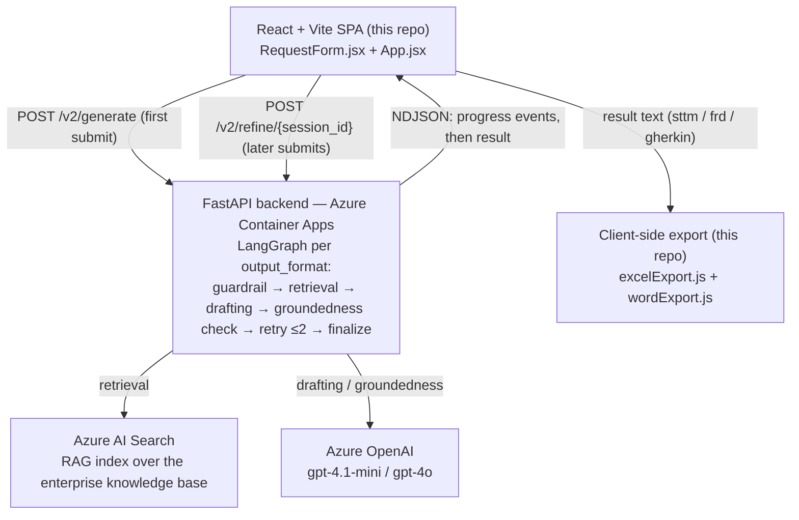
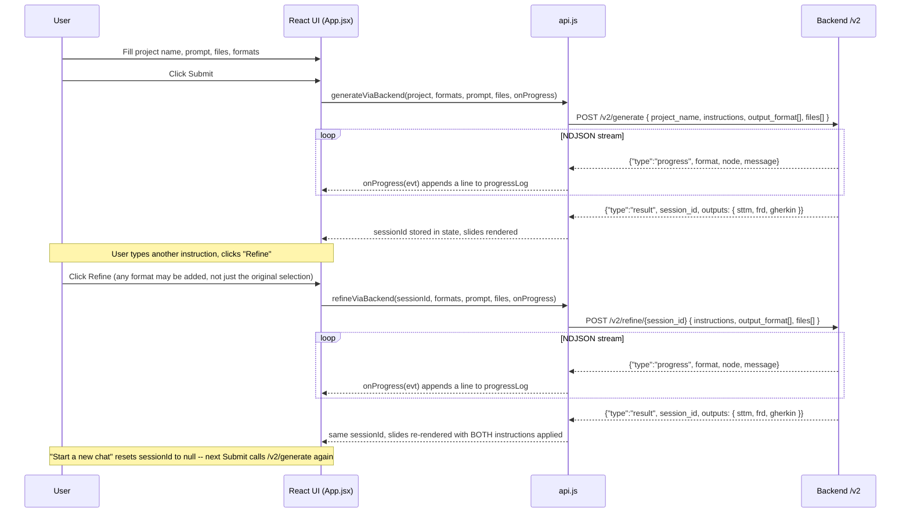
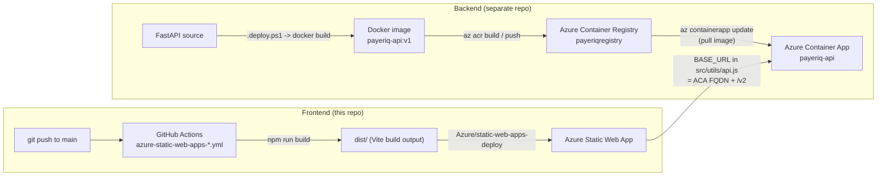
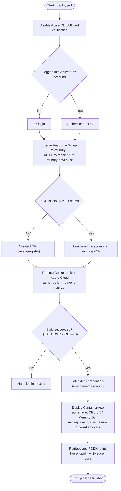

# Payeriq Frontend

React + Vite UI that collects a project name, a prompt ("agent instructions"), source files, and one or more output formats (Agile Artifact / FRD / STTM), then submits them to a FastAPI backend for generation.

## Architecture overview

- The backend returns **plain structured text only** — it does not generate `.xlsx`/`.doc` files itself. [`src/utils/excelExport.js`](src/utils/excelExport.js) (via `xlsx-js-style`) and [`src/utils/wordExport.js`](src/utils/wordExport.js) build those exports entirely in the browser from that text, after [`src/utils/textRenderers.js`](src/utils/textRenderers.js) splits it into on-screen HTML.
- `/v2/generate` and `/v2/refine/{session_id}` don't return one JSON body — they stream newline-delimited JSON: a `{"type": "progress", ...}` line per graph stage, then a final `{"type": "result", ...}` or `{"type": "error", ...}` line. See [Live progress during generation](#live-progress-during-generation) below.
- A previous version of this document (`architecture.txt`, kept alongside this README) described a single `/generate` endpoint with no session and a server-side `xlsx_builder.py` Excel engine. Both are superseded — generation is now session/refine-based and export happens client-side, as reflected in the diagram above.
- The backend's deployment pipeline (building the Docker image and standing up the Azure Container App this frontend talks to) is documented separately in [Backend deployment pipeline](#backend-deployment-pipeline).

## Request architecture — session-based, generate once then refine

Originally, this frontend kept **no** session, chat history, or conversation state: every click of Submit was a brand-new, self-contained `/v2/generate` request, and nothing from a previous submission was stored or replayed. That was the root cause of a real bug — typing "add column status101" and Submit, then "add column status102" and Submit, produced a document with only status102: the second request had no memory of the first, so it wasn't adding a column, it was starting over.

The frontend now tracks the backend's `session_id` and threads it through follow-up submits so instructions actually accumulate:

Key facts, with source references:

- [`src/App.jsx`](src/App.jsx) (`handleSubmit`) keeps a `sessionId` in React state. The first Submit calls `generateViaBackend` and stores the `session_id` the backend returns; every Submit after that calls `refineViaBackend(sessionId, ...)` instead, until the user clicks **Start a new chat** (`handleStartNew`), which clears `sessionId` and the rest of the form back to its idle state. That button is only enabled once a session exists — with no session yet, Submit is already starting fresh.
- [`src/utils/api.js`](src/utils/api.js) exposes `generateViaBackend` (`POST /v2/generate`) and `refineViaBackend` (`POST /v2/refine/{session_id}`). Both return `{ sessionId, text }` — `text` is built from `data.outputs[format]`, same shape for both endpoints.
- `output_format` does **not** need to match what the session was originally generated with — the format checkboxes stay enabled while a session is active, and checking a new one (e.g. adding FRD to an STTM-only session) just adds it. Per the comment above `refineViaBackend` in [`src/utils/api.js`](src/utils/api.js), each format runs on its own thread server-side, so a newly-added format starts its own thread rather than replaying the other formats' history into it. Only the **project name** field locks once a session exists ([`src/components/RequestForm.jsx`](src/components/RequestForm.jsx)), since it was fixed by the original `/v2/generate` call; the session banner clarifies that new instructions refine the current document and new formats get folded into it.
- Source files are required to start a session but optional on a refine call — the backend appends any new files to the session's existing `source_files` rather than replacing them. The frontend clears the uploaded-file chips after every successful submit so a later refine only resends files that are actually new.
- There is still no `localStorage`/`sessionStorage` — the session lives only in React state for the current page load. A page refresh loses `sessionId`, same as clicking **Start new**.

## Live progress during generation

`/v2/generate` and `/v2/refine/{session_id}` can take long enough — guardrail → retrieval → drafting → groundedness check → up to 2 retries → finalize, per requested format — that a bare spinner with no feedback looked stuck. Both endpoints now stream newline-delimited JSON instead of a single response body:

- [`src/utils/api.js`](src/utils/api.js) (`postFormStreaming`, `handleNdjsonLine`) reads the response body line by line as it arrives. A `{"type": "progress", format, node, message}` line is forwarded to an optional `onProgress` callback; a `{"type": "result", ...}` line is the final payload; a `{"type": "error", message}` line throws. If the environment doesn't support a readable response stream (e.g. a sandboxed preview), it falls back to reading and parsing the whole NDJSON body at once.
- [`src/App.jsx`](src/App.jsx) passes an `onProgress` handler into `generateViaBackend`/`refineViaBackend` that appends each event to a `progressLog` array (prefixed with the format label when more than one format is running at once) rather than overwriting the previous line — so a long, multi-retry, multi-format run reads as continuous progress.
- [`src/components/OutputPanel.jsx`](src/components/OutputPanel.jsx) renders `progressLog` as a checklist while `mode === 'generating'`: earlier lines get a checkmark, the latest line gets a spinner, and the panel auto-scrolls to keep the newest line in view.

## Output rendering

The backend returns one string per requested format, joined with a divider (`MULTI_FORMAT_DIVIDER`). [`src/utils/textRenderers.js`](src/utils/textRenderers.js) parses that text into HTML for on-screen display and, separately, into Word-compatible markup for `.doc` export — both parsers are pure functions of the text they're given; they do not talk to the backend and have no awareness of prior requests.

Export itself also happens entirely client-side, not on the backend:

- [`src/utils/excelExport.js`](src/utils/excelExport.js) splits the text on `## N. Title` headings into one sheet per section and builds a styled `.xlsx` with `xlsx-js-style` (borders, header fill/bold text matching the reference STTM workbook).
- [`src/utils/wordExport.js`](src/utils/wordExport.js) builds the `.doc` export the same way, from `renderDocText`'s output.

## Deployment & infrastructure

The UI and the backend deploy independently, on different pipelines, to different Azure services:

- **Frontend**: `.github/workflows/azure-static-web-apps-icy-water-06fd47710.yml` runs on every push to `main` (and on PRs), builds with `npm run build`, and uploads `dist/` straight to Azure Static Web Apps — no Docker involved on this side.
- **Backend**: Dockerized and pushed through Azure Container Registry to an Azure Container App, via the `.deploy.ps1` pipeline detailed below. That backend is a separate repo; the only coupling point is `BASE_URL` in [`src/utils/api.js`](src/utils/api.js), which has to be updated to the Container App's FQDN after a backend redeploy.

### Backend deploy script, step by step

This frontend talks to a FastAPI backend running as an Azure Container App. That backend's build/deploy pipeline (`.deploy.ps1`, documented in `flowchart.txt` alongside this README) is not part of this repo, but is summarized here for context on what's behind the `BASE_URL` in [`src/utils/api.js`](src/utils/api.js):

Once this pipeline finishes, the printed FQDN is what [`src/utils/api.js`](src/utils/api.js)'s `BASE_URL` needs to point at (with `/v2` appended) for this frontend to reach the backend.
